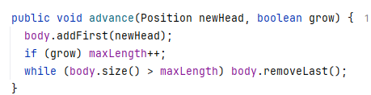
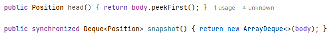
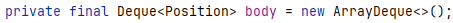
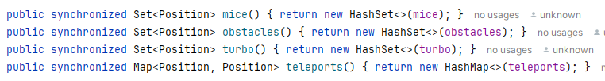
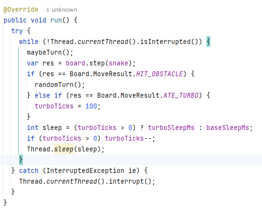
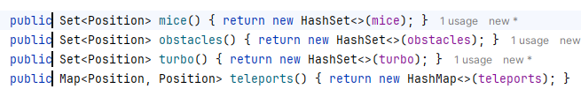
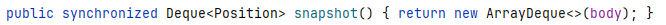
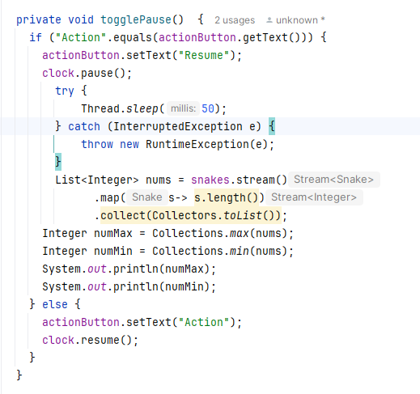
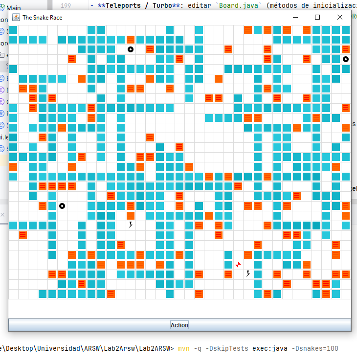

# Snake Race — ARSW Lab #2 (Java 21, Virtual Threads)

**Escuela Colombiana de Ingeniería – Arquitecturas de Software**  
Laboratorio de programación concurrente: condiciones de carrera, sincronización y colecciones seguras.

---

## Requisitos

- **JDK 21** (Temurin recomendado)
- **Maven 3.9+**
- SO: Windows, macOS o Linux

---

## Cómo ejecutar

```bash
mvn clean verify
mvn -q -DskipTests exec:java -Dsnakes=4
```

- `-Dsnakes=N` → inicia el juego con **N** serpientes (por defecto 2).
- **Controles**:
  - **Flechas**: serpiente **0** (Jugador 1).
  - **WASD**: serpiente **1** (si existe).
  - **Espacio** o botón **Action**: Pausar / Reanudar.

---

## Reglas del juego (resumen)

- **N serpientes** corren de forma autónoma (cada una en su propio hilo).
- **Ratones**: al comer uno, la serpiente **crece** y aparece un **nuevo obstáculo**.
- **Obstáculos**: si la cabeza entra en un obstáculo hay **rebote**.
- **Teletransportadores** (flechas rojas): entrar por uno te **saca por su par**.
- **Rayos (Turbo)**: al pisarlos, la serpiente obtiene **velocidad aumentada** temporal.
- Movimiento con **wrap-around** (el tablero “se repite” en los bordes).

---

## Arquitectura (carpetas)

```
co.eci.snake
├─ app/                 # Bootstrap de la aplicación (Main)
├─ core/                # Dominio: Board, Snake, Direction, Position
├─ core/engine/         # GameClock (ticks, Pausa/Reanudar)
├─ concurrency/         # SnakeRunner (lógica por serpiente con virtual threads)
└─ ui/legacy/           # UI estilo legado (Swing) con grilla y botón Action
```

---

# Actividades del laboratorio

## Parte I — (Calentamiento) `wait/notify` en un programa multi-hilo

- link al repositorio del calentamiento [**PrimeFinder**](https://github.com/miguelvanegas-c/PrimeFinder).

## Parte II — SnakeRace concurrente (núcleo del laboratorio)

### 1) Análisis de concurrencia

- Explica **cómo** el código usa hilos para dar autonomía a cada serpiente.
  1. **Snake:**
  Entidad con atributos (posición, dirección, puntuación) y comportamientos básicos.

  2. **Board:**
  Representación compartida del juego que actúa como punto de sincronización. Contiene el estado del tablero y gestiona el movimiento de todas las serpientes.

  3. **SnakeRunner:**
  Hilo de ejecución independiente (uno por serpiente) que ejecuta el ciclo de juego para cada snake.

**Manejo de Concurrencia**
- Cada SnakeRunner ejecuta en su propio thread y llama periódicamente a un método sincronizado en Board.

- Este método sincronizado (synchronized) actúa como sección crítica, permitiendo que solo una serpiente actualice el tablero a la vez.

- Esto previene la corrupcion del estado del tablero, debido a qeu dicho metodo es el unico que se modifica directamente el tablero.

  - **Identifica** y documenta en **`el reporte de laboratorio`**:
    - Posibles **condiciones de carrera**.
      * La clase Snake no implementa ningún mecanismo de sincronización para proteger su estado interno, lo que genera una falsa sensación de seguridad en algunos métodos que parecen estar protegidos cuando en realidad no lo están.
        El método advance() presenta un caso especialmente problemático de protección ilusoria:
    
      
    
      **ANÁLISIS DEL PROBLEMA**
          * Este método es solo invocado desde Board en el método step(), que es un método synchronized, esto crea una falsa sensación de seguridad.
          * El lock que se encuentra en el tablero realmente no protege la estructura modificada(body) en el método, debido a que no existe ningún bloqueo para snake.
          * En este punto el problema se agrava porque body es accedido por dos métodos más.
        
    

      - **head() y advance() problemas potenciales:**
        Este método al igual que advance son un problema potencial, debido a que su único llamado se hace desde el método step() que está sincronizado en board, 
        pero en caso de que en un futuro se agregue otra ruta de llamado pasara a ser un error de concurrencia.
      
      - **snapshot() Problema Activo:**
        Este sí es un problema grave debido a que el acceso proviene directamente desde la interfaz de usuario y **no está sincronizado**. Por lo tanto, no existe ningún mecanismo de bloqueo en la clase `Snake` al momento de realizar la llamada, lo que puede causar las siguientes consecuencias:
              1. Corrupción visual.
              2. Inconsistencia de datos. 
  
    - **Colecciones** o estructuras **no seguras** en contexto concurrente.
      * En la aplicación se identifican dos casos de colecciones no thread-safe operando en un entorno concurrente:
    
      

      Esta colección no es thread-safe y es accedida por múltiples threads sin sincronización adecuada, tal y como se explica en el punto anterior.

      * 

        * Estas colecciones (mice, obstacles, turbo, teleports) no son thread-safe por diseño, pero están correctamente protegidas mediante sincronización externa: todos los métodos que las acceden están marcados como synchronized.
        * Sin embargo, este enfoque es frágil porque depende de que todos los futuros accesos también sean sincronizados. Si se añade un método sin synchronized, se activarán condiciones de carrera.
        * **Alternativas**
          1. Usar Collections.synchronizedSet() / Collections.synchronizedMap().
          2. Usar colecciones concurrentes como ConcurrentHashMap.newKeySet() o ConcurrentHashMap.   
        El diseño actual funciona, pero en caso de extender e interactuar nuevamente con las estructuras puede haber problemas de sincronización.

    - Ocurrencias de **espera activa** (busy-wait) o de sincronización innecesaria.
      * El único posible caso de espera activa que se encontró es:
      
        
      
        Pero al usar un .sleep que libera la cpu no es considerado como busy wait.

      * En el caso de:

      
    
      Es una precaución bastante innecesaria debido a que los métodos devuelven copias de los originales, no los originales directamente. Por lo tanto, no es necesario que sean sincronizados los metodos.
      En cualquier caso si se desea tener una solución más robusta aunque es necesario cambiar la implementación se podría usar colecciones thread-safe del mismo Java.
    

### 2) Correcciones mínimas y regiones críticas

- **Elimina** esperas activas reemplazándolas por **señales** / **estados** o mecanismos de la librería de concurrencia.
  * No se encontraron casos reales de esperas activas, se pueden buscar diferentes implementaciones en el ciclo de la clase SnakeRunner como una barrera ciclica pero no seria posible
  implementar él tema de velocidades más altas.
  
- Protege **solo** las **regiones críticas estrictamente necesarias** (evita bloqueos amplios).
  * Se quitó synchronized en los siguientes casos y se le agregó al método snapshot:
  
  

  
    
Cambios explicados en el punto anterior.

### 3) Control de ejecución seguro (UI)

- Implementa la **UI** con **Iniciar / Pausar / Reanudar** (ya existe el botón _Action_ y el reloj `GameClock`).
- Al **Pausar**, muestra de forma **consistente** (sin _tearing_):
  - La **serpiente viva más larga**.
  - La **peor serpiente** (la que **primero murió**).
- Considera que la suspensión **no es instantánea**; coordina para que el estado mostrado no quede “a medias”.

* Para este punto en cada pausa se imprime la longitud de la serpiente más larga y la de la serpiente más corta, de la siguiente forma:



### 4) Robustez bajo carga

- Ejecuta con **N alto** (`-Dsnakes=20` o más) y/o aumenta la velocidad.
- El juego **no debe romperse**: sin `ConcurrentModificationException`, sin lecturas inconsistentes, sin _deadlocks_.
- Si habilitas **teleports** y **turbo**, verifica que las reglas no introduzcan carreras.



* No hay excepciones

---

## Entregables

1. **Código fuente** funcionando en **Java 21**.
2. Todo de manera clara en **`**el reporte de laboratorio**`** con:
   - Data races encontradas y su solución.
   - Colecciones mal usadas y cómo se protegieron (o sustituyeron).
   - Esperas activas eliminadas y mecanismo utilizado.
   - Regiones críticas definidas y justificación de su **alcance mínimo**.
3. UI con **Iniciar / Pausar / Reanudar** y estadísticas solicitadas al pausar.

---

## Criterios de evaluación (10)

- (3) **Concurrencia correcta**: sin data races; sincronización bien localizada.
- (2) **Pausa/Reanudar**: consistencia visual y de estado.
- (2) **Robustez**: corre **con N alto** y sin excepciones de concurrencia.
- (1.5) **Calidad**: estructura clara, nombres, comentarios; sin _code smells_ obvios.
- (1.5) **Documentación**: **`reporte de laboratorio`** claro, reproducible;

---

## Tips y configuración útil

- **Número de serpientes**: `-Dsnakes=N` al ejecutar.
- **Tamaño del tablero**: cambiar el constructor `new Board(width, height)`.
- **Teleports / Turbo**: editar `Board.java` (métodos de inicialización y reglas en `step(...)`).
- **Velocidad**: ajustar `GameClock` (tick) o el `sleep` del `SnakeRunner` (incluye modo turbo).

---

## Cómo correr pruebas

```bash
mvn clean verify
```

Incluye compilación y ejecución de pruebas JUnit. Si tienes análisis estático, ejecútalo en `verify` o `site` según tu `pom.xml`.

---

## Créditos

Este laboratorio es una adaptación modernizada del ejercicio **SnakeRace** de ARSW. El enunciado de actividades se conserva para mantener los objetivos pedagógicos del curso.

**Base construida por el Ing. Javier Toquica.**
